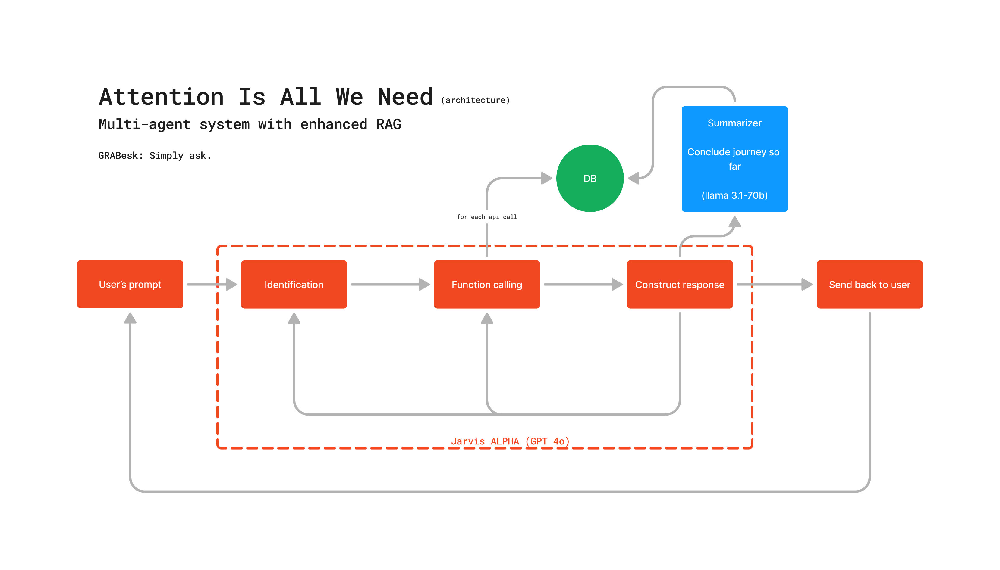
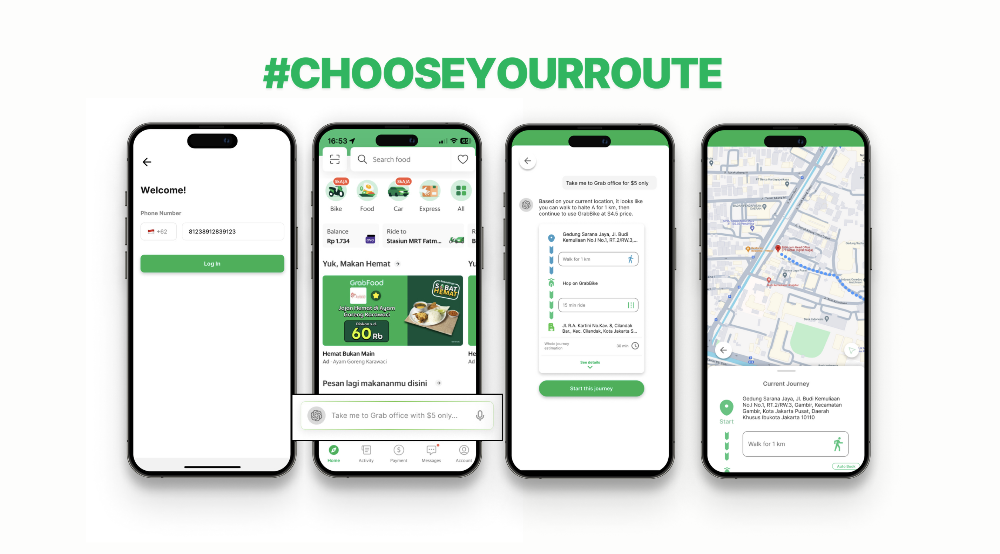
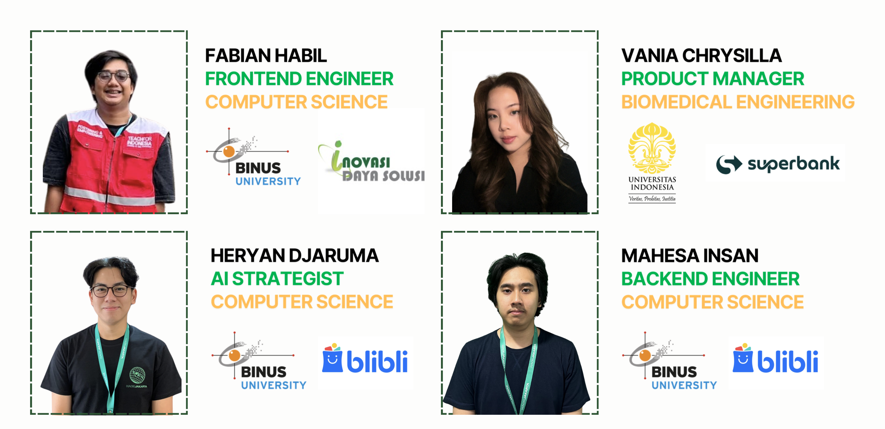

# AIAWN - Attention Is All We Need

 

### GRABesk - Hackathon project of *hackjakarta 2024* by team Smileyface :)

## Top-level Summary
GRABesk, with the tagline "Simply ask.", is a chatbot within the Grab app, designed to cater to Gen Z's food ordering preferences. It can handle users' food requests, such as "Find spicy food near me" or "I want Korean food." By recognizing the user's current location, GRABesk leverages OpenAI's latest generative AI model, enhancing its capabilities through a multi-agent and Retrieval-Augmented Generation (RAG) system. Additionally, GRABesk uses the Google Maps API as a substitute for Grab's in-house map, ensuring precise and efficient location services.

## How it Works

"Attention is All We Need" (AIAWN), the renowned paper from Google Research on transformers, has become the cornerstone of GPT models. In our design, we focus on maximizing four key elements as the "attention" that we need to think like LLM, which include:
1. Intent identification
2. Entity extraction
3. Reasoning
4. Response generation

We utilize multi-agent systems and Retrieval-Augmented Generation (RAG) as the core architecture, as depicted in the image above. Jarvis Alpha, our advanced model capable of complex reasoning, serves as the heart of our app. The RAG framework, enhanced by function calling, significantly improves the domain knowledge of our application.

## App Screeens

## Project contributors

- [Heryan Djaruma](https://www.linkedin.com/in/heryandjaruma/), Lead & AI Strategist
- [Fabian Habil Ramdhan](https://www.linkedin.com/in/fabianhabil/), Frontend Developer
- [Mahesa Insan Raushanfikir](https://www.linkedin.com/in/mahesainsan/), Backend Developer
- [Vania Chrysilla](https://www.linkedin.com/in/vaniachrysilla/), Product Manager

